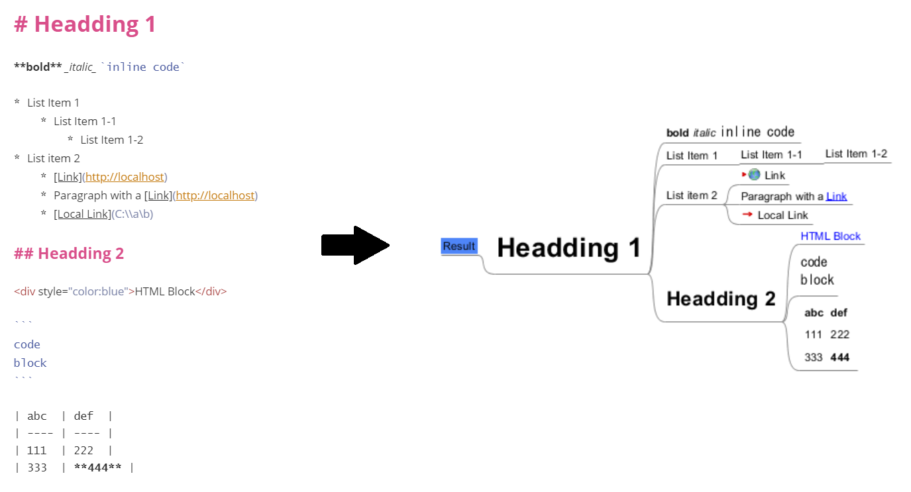

# md-to-mm

A simple CLI application that converts a markdown file to a Freeplane mind map file.

## How to Use

1. Download md-to-mm.exe from [here](https://github.com/unhurried/md-to-mm/raw/v0.1.0/build/md-to-mm.exe).

Currently, an executable file is provided only for Windows (.exe) in this project. For other platforms, please build by yourself.

2. Execute the application in your terminal.

```shell
# It will generate result.mm file in the same directory with the input file.
md-to-mm.exe test.md
```

Alternatively, you can drag and drop the input file onto the executable file.

### Example

[example.md](./example.md) will be converted into [result.mm](./result.mm).



## How to Develop

Configuration for [devcontainer](https://code.visualstudio.com/docs/remote/containers) is included in .devcontainer directory.

### Run the Application for Development

```shell
go run main.go
```

### Build the Application

```shell
# It will generate md-to-mm.exe in build directory.
go build -o build
# To generate an executable for windows/amd64
GOOS=windows GOARCH=amd64 go build -o build
```

### Frameworks and Libraries 

* Golang 1.17
* [blackfriday/v2](https://pkg.go.dev/github.com/russross/blackfriday/v2)
